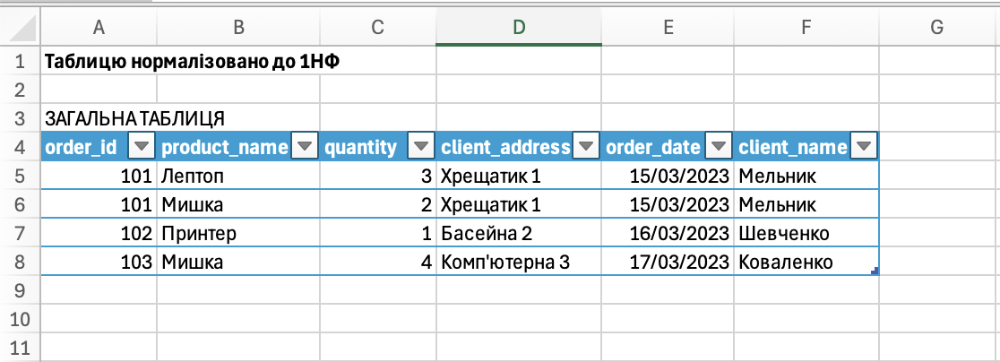
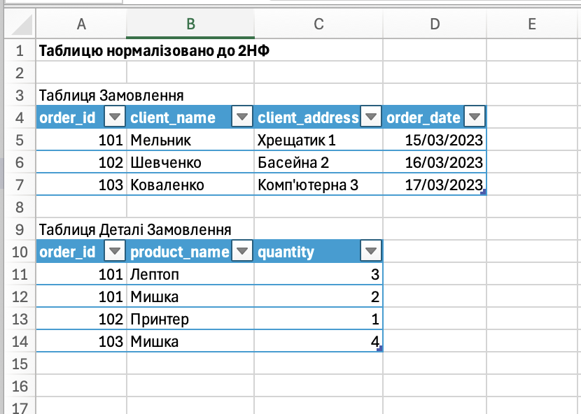
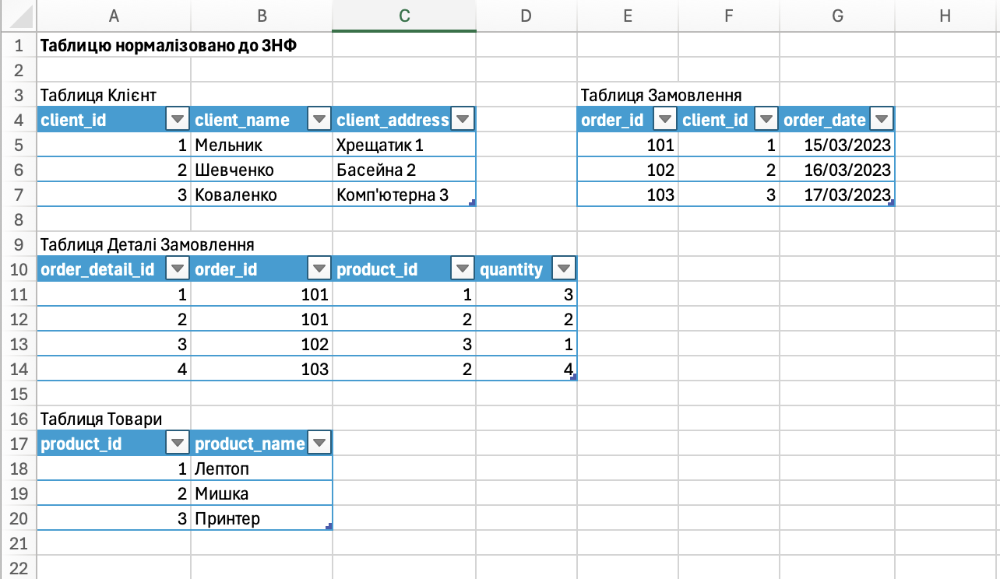
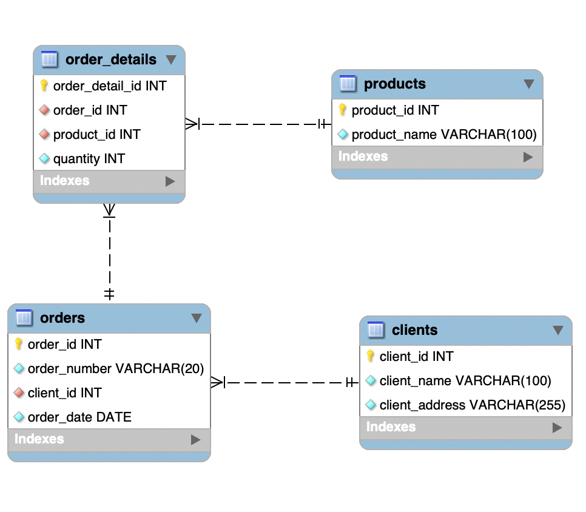
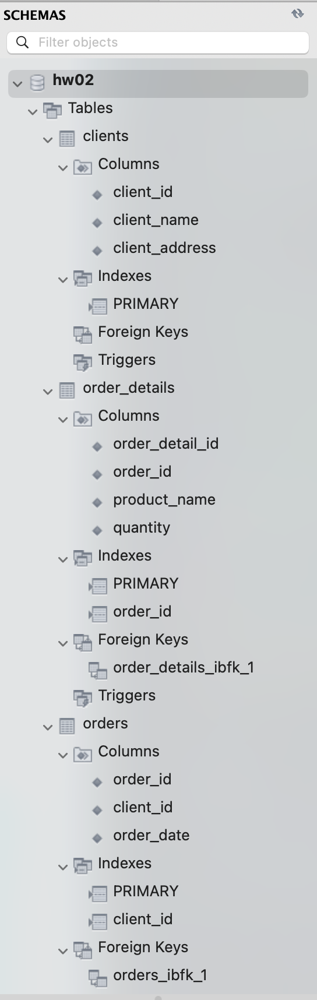
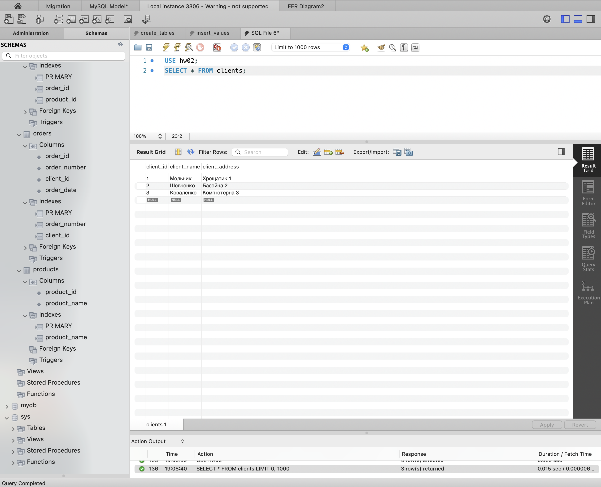

# goit-rdb-hw-02

ДЗ з курсу РБД. Нормалізація таблиці до 3НФ, ER діаграма та створення таблиць у MySQL.

## Структура репозиторію

| Файл | Опис |
|---|---|
| normalized_table.xlsx | Таблиці на кожному етапі нормалізації (1НФ, 2НФ, 3НФ) |
| create_tables.sql | Створення БД hw02 і таблиць clients, products, orders, order_details |
| insert_values.sql | Заповнення таблиць даними |
| select.sql | Перевірочні запити: SELECT до таблиці clients і JOIN, що збирає вихідну таблицю |
| screenshots | Скріншоти до кожного пункту завдання |

## Етапи Нормалізації

| Етап | Опис | Результат |
|---|---|---|
| 1НФ | Товари з однієї комірки рознесено по окремих рядках. Усі значення атомарні. |  |
| 2НФ | Часткові залежності усунуто. Дані розділено на Замовлення та Деталі замовлення. |  |
| 3НФ | Транзитивну залежність order_id -> клієнт -> адреса усунуто, клієнтів винесено в окрему таблицю. Назви товарів винесено в окрему таблицю Товари. |  |

## ER Діаграма

Зв'язки між таблицями:
- clients 1 : N orders - клієнт може мати багато замовлень;
- orders 1 : N order_details - замовлення містить один або більше товарів;
- products 1 : N order_details - один товар може входити в багато замовлень.

## Зміни після ревʼю

- Назви товарів винесено в окрему таблицю `products`. В `order_details` тепер зберігається `product_id` (зовнішній ключ) замість назви, тож зв'язок працює через індекс.
- У таблицю `orders` додано поле `order_number` (VARCHAR, UNIQUE) для номера замовлення в довільному форматі. `order_id` лишився технічним ключем тільки для зв'язків.

## Запуск

Запустити скрипти в MySQL у такому порядку:
1. `create_tables.sql` (перестворює БД hw02 з нуля)
2. `insert_values.sql`

## Схема БД і Тестування

У базі hw02 було створено чотири таблиці - clients, products, orders, order_details.

SELECT * FROM clients поверне 3 рядки без дублікатів, як і очікується. JOIN усіх чотирьох таблиць поверне 4 рядки, ідентичні вихідній таблиці. Для перевірки можна запустити `select.sql`.

